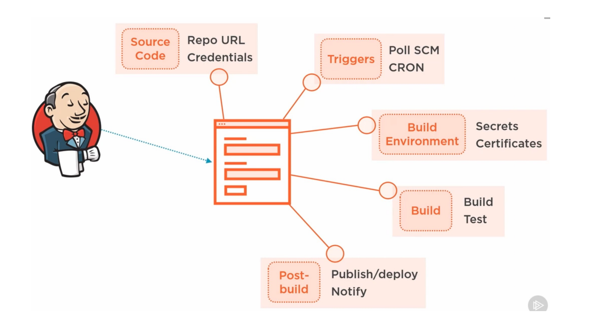
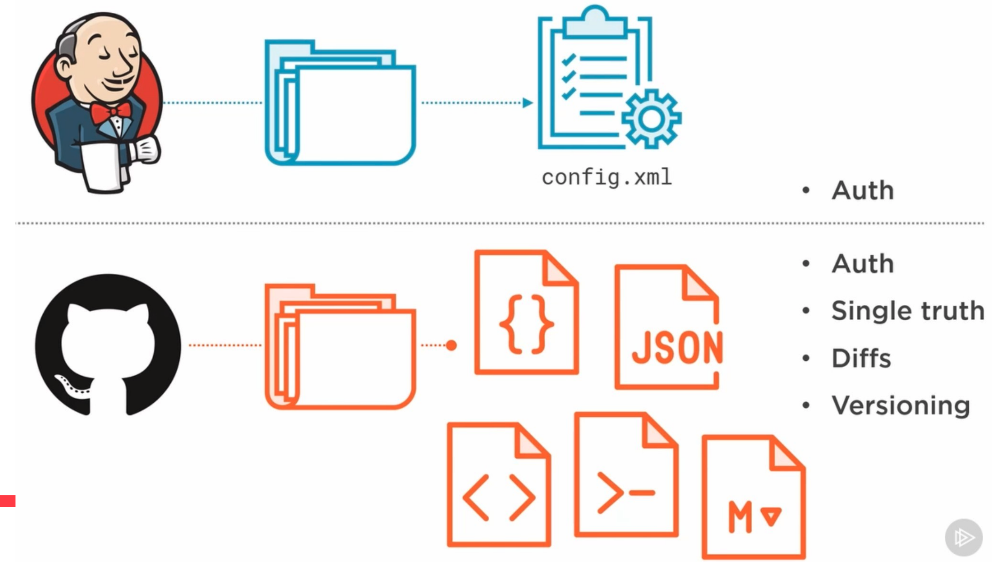
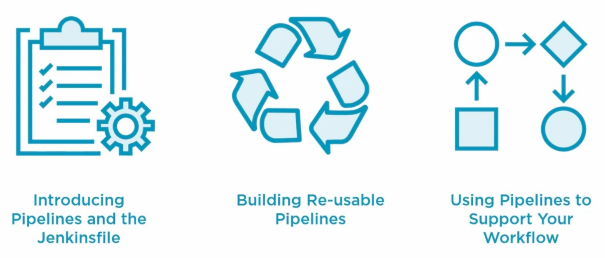
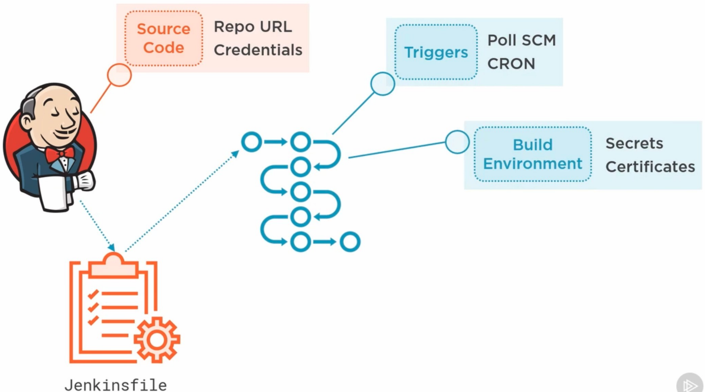
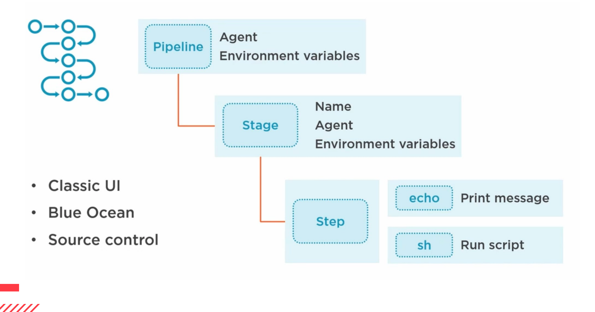
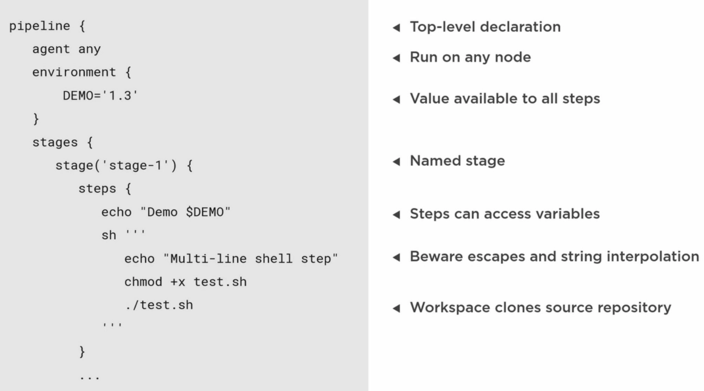

# Class-07-CICD-Jenkins

- [Class-07-CICD-Jenkins](#class-07-cicd-jenkins)
- [课堂笔记](#----)
- [课程内容](#----)
- [Jenkins](#jenkins)
  * [第三方插件](#-----)
  * [Install Jenkins on Docker](#install-jenkins-on-docker)
  * [how to install Jenkins and run it in a Docker container.](#how-to-install-jenkins-and-run-it-in-a-docker-container)
  * [2.Expose-Jenkins-to-Public-Internet](#2expose-jenkins-to-public-internet)
    + [Description](#description)
    + [反向代理 - Reverse Proxy](#-------reverse-proxy)
    + [ngork](#ngork)
  * [创建pipeline的类型](#pipeline---)
  * [Task - My first pipeline - freestyle pipeline](#task---my-first-pipeline---freestyle-pipeline)
  * [Task - 创建 pipeline 类型的pipeline](#task------pipeline----pipeline)
- [课后复习](#----)
- [知识补充](#----)
  * [Jenkins History](#jenkins-history)
  * [Jenkins Core Concept](#jenkins-core-concept)
  * [Jenkins Pipeline](#jenkins-pipeline)
  * [Jenkins Configuration Management](#jenkins-configuration-management)

# 课堂笔记
# 课程内容
- Jenkins做CICD pipelines
  - Introduction
  - Install
- 反向代理（ngrok）
- 与git链接
- 创建pipeline

# Jenkins
提供多种安装方式，本身提供docker image，发布在docker image repo中，可以直接使用docker快速的建立一个迷你的Jenkins instance

Jenkins只是做任务的协调和调配，本身未提供任何的CI/CD的工具和能力，非常简单的任务调度工具。 流行的原因1. 简单。2. 开源且免费。 3. 可扩展性强，大量的plug-in。

由自己搭建，维护，更新的一台server。由于是开源软件，需要自己做所有的管理，如版本的更新，配置机器硬件，网络安全配置，账户账号权限配置等，无任何技术支持。有些环境需要自己配置，

## 第三方插件
- pull code from github
- build cloud

## Install Jenkins on Docker
- 需要一个叫做Jenkins_home的目录
  其中保存了所有创建的pipeline，以及build过程中产生的所有artifacts

## how to install Jenkins and run it in a Docker container.

### Pre-requisite

* Software: Docker

### Steps

#### 1. Create a folder to hold Jenkins data

```bash
mkdir jenkins_home
cd jenkins_home
```

#### 2. Start a Jenkins container

```bash
docker run --name jenkins \
           -u root \
           -d \
           -v $(pwd):/var/jenkins_home \
           -v /var/run/docker.sock:/var/run/docker.sock \
           -p 80:8080 \
           -p 50000:50000 \
           jenkins/jenkins:lts-jdk11
```

 Note:

 * `-u root` configures to run Jenkins by root user.
 * `-d` detaches the container
 * `-v $(pwd):/var/jenkins_home` mounts the current directory to Jenkins home inside the container
 * `-v /var/run/docker.sock:/var/run/docker.sock` mounts Docker socks
 * `-p 80:8080` maps port 80 in the host to port 8080 inside the container
 * `-p 50000:50000` maps ports 50000 which is the default port for angent registration
 * `jenkins/jenkins:lts-jdk11` is the image maintained by `jenkin`.
 * If you have error with port 80, please change it to 8080 or other port numbers.

Windows
```
$pwd = (Get-Location).Path
$pwd = $pwd -replace '\\', '/'
docker run --name jenkins `
           -u root `
           -d `
           -v "${pwd}:/var/jenkins_home" `
           -v //var/run/docker.sock:/var/run/docker.sock `
           -p 80:8080 `
           -p 50000:50000 `
           jenkins/jenkins:lts-jdk11
```

#### 3. Open <http://127.0.0.1> and you should see screen below

#### 4. Get your password by opening `secrets/initialAdminPassword` file in the directory you created in the first step

```bash
sudo cat secrets/initialAdminPassword
```
You can also get the initial password from your Docker container log, or you can bash into your Docker container and get it from inside:

To see the docker container id

```bash
docker container ls 
```
Then enter in bash inside a container.

```bash
docker exec -it CONTAINER_ID bash
```

#### 5. Continue installation in step #3 with password from step #4

You should see the dashboard for Jenkins 

### 认识界面
本身没有Agent去跑CICD，Jenkins Server 主管任务分发。

本身有两个Executor，只支持run两个job。企业中不会用executor 去run job，只使用其调度任务，具体任务会下发到Agent。

根据企业需求准备对应Env的Agent，链接到Jenkins，链接时使用port number：50000
Agent链接到Jenkins可查看官方文档。


## 2.Expose-Jenkins-to-Public-Internet

### Description
This is to demo how to expose a server inside the firewall to public internet via ngrok

安装好的Jenkins只能通过本地访问，在企业中可以做私有化部署，放在企业的内网里面，通过内网访问。在实际工作中若有远程办公的需求，Jenkins需要能够被外部访问，因此要添加反向代理。

### 反向代理 - Reverse Proxy
对外提供一个public port - endpoint on the Internet

内网添加一个组件，Reverse Proxy，对外提供一个public port (endpoint on Internet), public port收到的流量转发给Jenkins，Jenkins的反馈再通过public p port 发回给用户。

在实际环境中，企业会有Public IP，可直接将public IP attach到Reverse Proxy上，可以避免将public IP直接提供给Jenkins Server。

可以做很多的安全设置和策略，流量分发，流量筛查，访问许可等。

### ngork
用户注册： https://dashboard.ngrok.com/login

跟着提供的步骤set up
1. download 根据本机操作系统下载，win10，linux，mac-int，mac-apple silicon等
2. unzip文件
3. run ngrok config file
  其后面跟的authtoken 是唯一的，属于用户自己的。
4. deploy应用程序，expose 应用程序到Internet上
5. 生成相应的public domain name

ngork可以装在docker instance上，可以将ngork当成container，但是企业中不允许这样操作，因为这样操作相当于穿透了企业内网，可能会导致安全问题。

Jenkins
如果通过public访问，manage Jenkins中会有错误信息，因为Jenkins的URL和访问地址不一致。可以将新的URL替换为ngork提供的新的public URL（manage Jenkins - System - Jenkins URL）


## 创建pipeline的类型

fork hello-Jenkins repo from github fork到自己的github中

创建pipeline的各种类型：
  - Freestyle
  经典的pipeline类型，支持一个source code management，按照顺序执行build steps，也支持post-build steps，可以做archiving artifacts 和发送电子邮件通知，若要发送电子邮件通知，需要准备和配置一台SMTP（电子邮件服务）Server。
  - Pipeline
  现在用的较多，可运行一个长时间build的任务，比如说build的任务有很多步骤，用到很多agent，需要长时间运行而且其中的steps很复杂，其中有各种各样的控制等。
  - Multi-configuaration project
  可以创建不同的Environment，针对不同的environment去运行pipeline，根据不同environment不同，带进去的configuration也不同。
  - Folder
  pipeline放在其中，用于organiz pipeline的。
  - Multibranch Pieline
  在开发环境用的多，可以cover和监听多个branch
  - Organization Folder
  层级化目录，创建一级一级的目录，方便管理。

## Task - My first pipeline - freestyle pipeline
https://github.com/australiaitgroup/DevOpsNotes/tree/main/WK4_Jenkins_and_GitHub_Actions/Wk4.1/3.Integrate-with-Github 

github hook - 给github 提供一个hook。当github 有event出现，我们可以设置github拉一下该hook。（add webhook jenkins URL + github-webhook/）

Jenkins中可以添加Build Steps, 使用Jenkins file，Jenkins自己创建的文件格式
```jenkinsfile
pipeline {
    agent any

    stages {
        stage('Build') {
            steps {
                echo 'Building..'
            }
        }
        stage('Test') {
            steps {
                echo 'Testing..'
            }
        }
        stage('Deploy') {
            steps {
                echo 'Deploying....'
            }
        }
    }
}
```
steps需要用raw script实现，如果用Azure DevOps只添加参数。
Azure DevOps中也可以添加bash script，用于修改机器配置，更新文件，批量化的操作等等。

使用Jenkins file的好处是将pipeline configuration放在source code一起管理（和yaml一样）可根据source code同步更新和管理。

在Jenkins file中可以添加if-else condition，根据condition执行特定的步骤，可以检查环境变量，当environment有特定变量的时候做特定的步骤，也可以用bash script，在pipeline的级别我们可以设置环境变量，只针对pipeline有效，但一般不会将access keys，token，psw等信息放在pipeline，真正的信息会放在Jenkins credential中，用于管理key values，可通过调用使用。

## Task - 创建 pipeline 类型的pipeline
Definition - Pupeline script from SCM
Repository - 
Script Path -  (Jenkinsfile) or (jenkins/Jenkinsfile) or (pipeline/Jenkinsfile)

通过插件或pipeline file内做限制，ignore一些文件的更新不会触发build。

# 课后复习
旧内容不会讲，自行查看学习
https://github.com/australiaitgroup/DevOpsNotes/tree/main/WK4_Jenkins_and_GitHub_Actions/Wk4.3

预习 Hands on lab
https://github.com/australiaitgroup/DevOpsNotes/tree/main/WK4_Jenkins_and_GitHub_Actions/Wk4.2/5.Hands-on-a-Simple-Pipeline

# 知识补充
## Jenkins History
  The leading open source automation server, Jenkins provides hundreds of plugins to support building, deploying and automating any project.
- 2004 - Kohsuke Kawaguchi created Hudson in
  Sun Microsystem
- 2005 - Hudson is released
- 2011 - Hudson renamed to Jenkins after Oracle
  purchased Sun Microsystem
- 2010 - CloudBees is created
- 2014 - CloudBees shifts focus to Enterprise
  Jenkins and provide commercial support to Jenkins.
- 2014 - Kawaguchi becomes CTO of CloudBees
## Jenkins Core Concept
  

    Jenkins Job
    Jenkins Build
    Jenkins Plugin
    Jenkins View (Dashboard View)
    Jenkins Node: Master/Agent
    Jenkins Credential
    Jenkins Configuration
    Jenkins Logs
    Jenkins SSO and Global Security
    Jenkins Pipeline


## Jenkins Pipeline
What is Jenkins Pipeline?

Jenkins Pipeline is a combination of plugins that supports integration and implementation of continuous delivery pipelines. It has an extensible automation server to create simple and complex delivery pipelines as code via pipeline DSL. A Pipeline is a group of events interlinked with each other in a sequence.


- Jenkins 有两类config.xml
  
  在Jenkins home之下的config.xml是Jenkins server的配置文件。
  另外在每个job或project自己的目录下，还有一个config.xml。它包含了是这个job的配置信息。
  

- Jekinsfile

  Jenkins pipelines can be defined using a text file called JenkinsFile. You can implement pipeline as code using JenkinsFile, and this can be defined by using a domain specific language (DSL). With JenkinsFile, you can write the steps needed for running a Jenkins pipeline.
  
  
  
  
  

- Jenkins Pipeline - in real world
  


## Jenkins Configuration Management
We configured Github Pipeline and Plugins manually in Jenkins. This should be
automated.
There are a few ways to automate this.
1. Dockerise Jenkins and add the configuration into Dockerfile - https://github.com/
jenkinsci/docker/blob/master/README.md
2. Use configuration management tool to configure Jenkins
Jenkins doesn’t use any database and uses plain file system. We should backup
Jenkins configuration files and logs as well.
There are also a few ways.
1. Use backup plugins to backup
2. Backup file system regularly