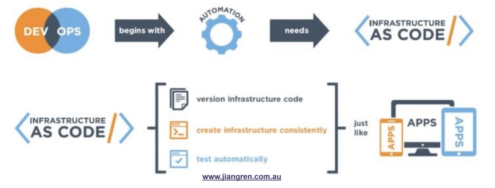
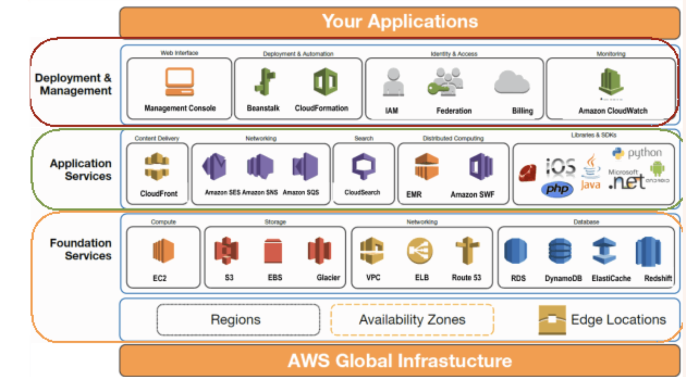
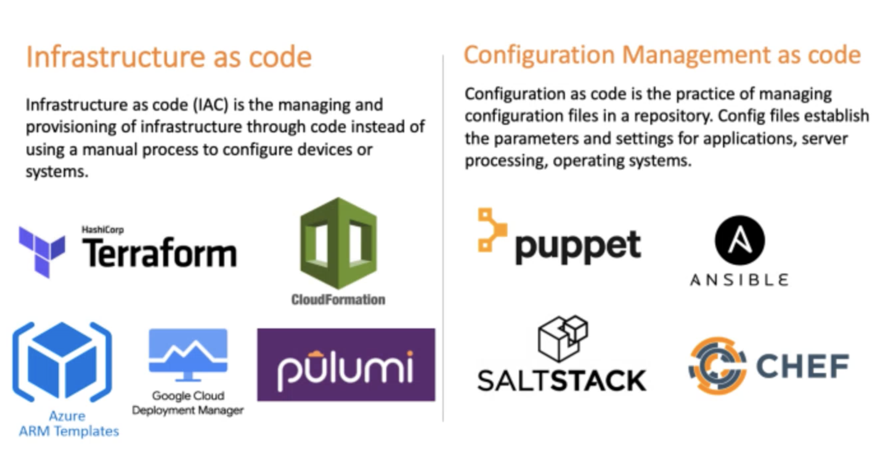
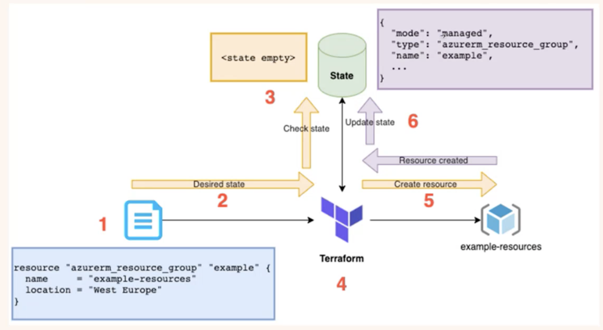
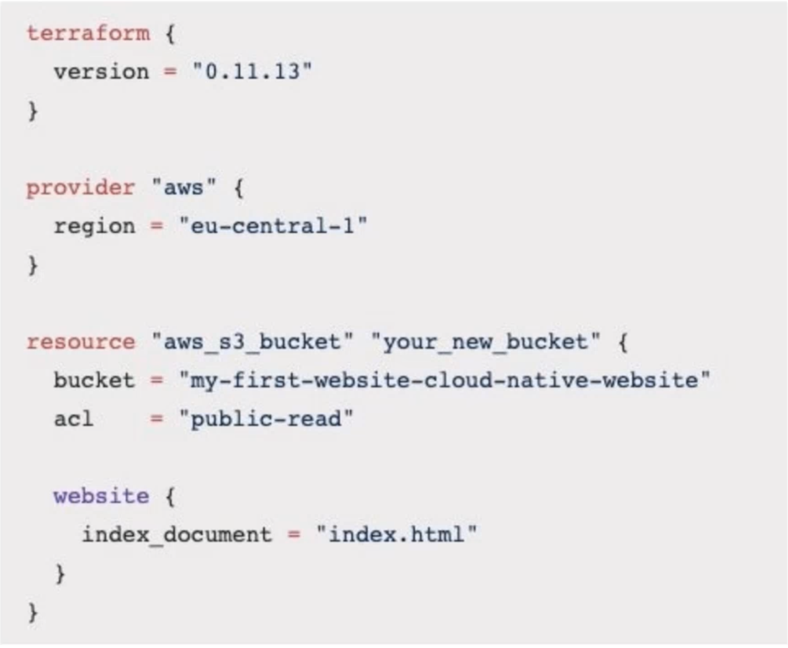
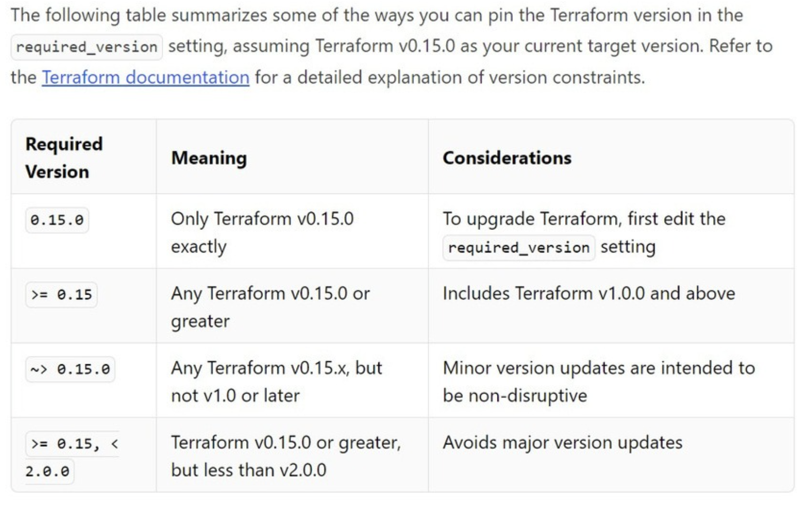

# Class 11 - IaC with Terraform
# Lecturer - Sai Li

# 主要知识点
  - [1.Infrastructure as Code and Tools](#1infrastructure-as-code-and-tools)
    - [1.1 What is Infrastructure as Code](#11-what-is-infrastructure-as-code)
    - [1.2 What “Infrastructure”?](#12-what-infrastructure)
    - [1.3 Infrastructure in AWS](#13-infrastructure-in-aws)
    - [1.4 The problems IaC can solve](#14-the-problems-iac-can-solve)
  - [2.Terraform Overview](#2terraform-overview)
    - [2.1 What is Terraform](#21-what-is-terraform)
    - [2.2 Terraform CLI](#22-terraform-cli)
  - [3.Terraform Basic Concepts](#3terraform-basic-concepts)
    - [3.1 The Language (HCL)](#31-the-language-hcl)
    - [3.2 Planning & Applying](#32-planning--applying)
    - [3.3 State](#33-state)
    - [3.4 Dependency Resolution](#34-dependency-resolution)
    - [3.5 File Structure](#35-file-structure)
    - [3.6 Providers](#36-providers)
    - [3.7 Variables](#37-variables)
    - [3.8 Output](#38-output)
  - [4.Terraform Best Practices](#4terraform-Best-Practices)
  - [4.Terraform Hands-on](#4terraform-hands-on)
  - [5.Homework](#5homework)

# 课前
 - 熟悉Slack，可设置任务的第二天提醒
 - 注意权限的设置，避免risks，遵循Principle of Least Privilege

# 课堂笔记
# 1.Infrastructure as Code and Tools
## 1.1 What is Infrastructure as Code
- Write code to represent your infrastructure requirements
- Use an IaC tool to apply those changes to your cloud/on-prem environment.

用代码去管理资源架构：静态描述, 动态管理
可以进行版本控制，可以追溯架构在某一时刻符合什么状态


- 是一种管理资源配置的方法，将资源配置标准化，方便于tracking，而且可以和代码一起管理。
- 运维需要做很多的Automation
- 在代码中，在github中可以track设置，每次代码变更和infra设置更改都可以在history中明显的查到，因此实现了透明化。
- 代码放进去之后可以自动tragger，实现自动的CICD，因此速度更开
- 保持了一致性，测试环境和部署环境一致，降低了误操作风险，提高了用户的信心

## 1.2 What “Infrastructure”?

非云端架构：laptop
云端架构：AWS

- IAAS: 只提供算力和存储，自己搭建内容（自己买菜回家做，全部可控，灵活但费时间）
- PAAS：提供平台服务，不用担心底层Infra，提供简单功能，如Queue，database，identity，半成品（预制菜，口味不能变，冷热可控）
- SAAS：一个成品，提供各种软件的服务，拿来直接用。（餐厅点菜，口味，冷热都不可控，省时间但低灵活性）

## 1.3 Infrastructure in AWS


注意color code，根据颜色可分辨新服务的类型。

## 1.4 The problems IaC can solve
- POC - proof of concept
怎样管理架构，怎么描述架构（给非技术人员看）

- Broadingly speaking, there are 3 kinds
  - Create/change/destroy infrastructure resources. 创建/更新/删除架构上的资源，eg，database，storage
  - Deploy/update applications on top of the infrastructure. 管理架构上的业务，架构上资源的应用，eg，创建一个博客，还要安装和调试，才能使用应用.
  - Manage the configurations used by the applications. 管理架构上应用的配置，eg，博客的域名，博客的管理团队，用的皮肤，一些更加细分的配置. 家用应用不太需要这个，但企业级应用就需要，比如几十万个博客管理，就需要用代码来管理，人为管理耗时耗力还容易出错，但代码管理可以实现automation，避免出错.


## Which tools for which?
### IAC (盖房子时候设置布局和结构，硬装修)
- Terraform - 开源的项目
- AWS - CloudFormation
- AZURE - Arm Templates
- GCD - GCD manager
- pulumi
### Configuration Management as code(基于硬装修，部署软装修，是对硬件设置的管理)
- puppet
- Ansible
- saltstack
- CGEF

# Terraform Overview
## What is Terraform
Terraform is a Infrastructure as Code(IaC) tool that allows you to script the creation, updating and deleting of (mainly) cloud resources.

用脚本/代码形式创建更新删除主流云端资源.

Hashicorp also owns Vagrant, Packer, Consul, Vault etc. See https://www.hashicorp.com/

解决了环境不一致的问题和部署速度慢的问题，也解决了缺乏审计性的问题，扩展性差的问题，成本不可控的问题，以及协作困难的问题。
## How Terraform works


如果Terraform创建了两个资源，其中一个被手动删除了，Terraform会补全被删除的资源继续运行。

https://medium.com/@mehmetodabashi/how-to-updateterraform-state-file-with-manually-changed-resources-2407b4843a55
## Terraform CLI
- Client Based standalone
- Vendor Agnostic
- Declarative Configuration
- Written in Golang
- Open source
- Use own syntax -HCL (Hashicorp Configuration Language). 有自己的语言，自己脚本的逻辑，HCL，支持多个云


public module registry - 中间件，Terraform和所有云厂商的协议。

***如何查找github中的特殊语言代码，（如何抄代码）***

两个关键词 内容和语言。
搜索框中输入 S3 language:HCL。
寻找与s3相关的用HCL写的内容。
可以选择搜索的范围，在repo中，在用户名中，以及全网搜。
（优先搜索用户名中的代码内容，同事之前写的，更可能符合当前企业的规范和要求。）

### Tiny Terraform Example

基于resource查Terraform的官方文档。查询变量的接受值。查询过程中注意版本的选择

### Terraform version constraints

版本不同接受的参数不同。

# Terraform Basic Concepts
- The language -HCL
- Planning & Applying. 
  - 管理架构时有不同步骤和不同阶段，这两个是不同阶段，planing可以真实了解实施之后出现的风险和问题。
- State. 最后一次跑过，最接近现实实施的状态，每当对架构更改，状态文件会更改.
- Dependency Resolution. 如何解决代码里描述的资源与资源相互依赖的关系.谨慎使用，如果用乱了可能会产生死锁。
- File Structure. 文件结构，怎样放置文件.
- Providers. 可能有一个或多个，99%是专注于一个。所能管理的云平台，eg, aws.
- Variables. 变量

## The Language (HCL)
Hashicorp Configuration Language(HCL) 
https://github.com/hashicorp/hcl


## Planning & Applying
- terraform init
- terraform plan 
- terraform apply 


init 的过程，初始化后端，把需要的东西下载准备好。
plan和apply可以一直循环. 用terraform管理的资源是希望一直能跑的，一直能更新.

terraform文件.ts 像是盖房子的蓝图，调用的provider(如: AWS, GCP等)相当于叫的建筑队，施工队，

### State file （.tfstate）
How does Terraform track what resources it creates.

跟踪资源，映射关系，优化性能，如同监理角色。

Terraform怎样知道目前项目有什么资源?
每次用terraform跑完架构会生成状态文件, 下次再用terraform管理架构，会看状态文件来得知两次架构是否完全一致，可以得知接下来terraform要进行什么操作.


## Dependency Resolution
谁依靠谁，谁在等谁

Generate a visual representation of the config plan with
> https://graphviz.org/download/
   
可以看架构里资源有怎样的依赖关系:


注释和取消注释的快捷键：command + /

如果某个工程师将statefile lock之后放假了，Terraform可以force unlock。

file中的.svg文件可以用解析文件生成一个graph，清楚的看出依赖关系。

Find out error beforehand, e.g Cyclic Dependencies

**如果两个资源相互依赖，terraform不会报错，但是不会运行，因为它们都在等自己的依赖出现，第二个在等第一个出现，第一个在等第二个出现。**

依赖慎用，如果两个资源有强关联性的时候，某个资源必须等另一个资源建好了的时候，才需要用depends_on。

名字‘example’虽然不重要，但是最好给一个有意义的内容描述很重要。

## File Structure
- Terraform magically import all tf files in the current directory.
- Common convention is to have a main.tf as an entry point.
- What if you want subdirectories?

.tfstate是当前运行的状态，.tf文件是目标状态，想要的状态，运行时会对比两文件的状态，如果不一致就会执行增删改而达成.tf的状态。
## Providers
- Usually specified in the main.tf file


credentials文件中设置了指定的账号信息。

使用git ignore 屏蔽和保护有个人敏感信息的文件和文件夹。

- https://www.terraform.io/docs/providers/


支持K8s和datadog，k8s 可以基于cpu和memory 执行auto scaling，k8s可以读取datadog的reading，检测用户数量，当用户数量达到阈值就提前启动机器进行auto scaling，能够更早的scale up。

## Variables
- Define any variable and later refer to it.
- A good use case is to define variables for multiple environments.
  - env=dev or env= prod.


**跨不一样的环境给不同的变量名。或者是在特定环境下控制做或者不做某些事情。**

## Output
Usually define the output to show the link of the resource. 

**输出：每次跑完terraform，告诉你需不需要打印一些内容.是建好之后的反馈，包括一些资源的详细信息。**

# Terraform best practices
## Code Structure and Organization:
- Modular Design: Break down your infrastructure into reusable modules to promote consistency, readability, and maintainability. （模块化，做好模块方便之后的复用）
- Standard Module Structure: Follow a standard directory layout for modules (main.tf, variables.tf, outputs.tf) to ensure consistency across projects. （文档标准，如存储和vm分开，每个文件执行一个任务，标准化管理文档）
- Version Control: Use a version control system (like Git) to track changes, collaborate effectively, and revert to previous states if needed. （可发布，可回滚。发布失败后可回滚到之前的版本）
- Descriptive Naming: Use clear and consistent naming conventions for resources, variables, and outputs to improve readability.（使用有意义的名字命名）

## Coding Practices:
- Input Validation: Use variable validation to ensure input values meet specific criteria, preventing errors and unexpected behavior.（input要写好）
- Remote State: Store Terraform state remotely (e.g., in Terraform Cloud, AWS S3) to enable collaboration and prevent data loss.（hands-on）
- Data Sources: Leverage data sources to fetch information about existing resources and avoid hardcoding values.（尽量不要用手动创建资源，在production上最好的是将手动创建资源的部分都移除，通过terraform account来创建）
- Loops and Conditionals: Utilize loops (e.g., count, for_each) and conditionals (e.g., if) to create dynamic and flexible configurations.
- Avoid Hardcoding: Avoid hardcoding sensitive values (e.g., passwords, API keys) in your code. Use environment variables or secret management tools.（要注意保护装好安全，将敏感信息单独写在一个文件中，key management，然后terraform单独来读这个key。避免明码写在文件中）

## Testing and Automation:
- Automated Testing: Write unit tests and integration tests to validate the correctness of your Terraform configurations.
- Continuous Integration/Continuous Deployment (CI/CD): Integrate Terraform into a CI/CD pipeline to automate the provisioning and deployment process.

## Collaboration and Security:
- Code Reviews: Conduct code reviews to catch errors, improve code quality, and share knowledge among team members.
- Policy as Code: Define policies using tools like Sentinel to enforce security and compliance standards in your infrastructure.（比如某些资源不可以删除）
- Least Privilege: Follow the principle of least privilege by granting Terraform the minimum permissions necessary to manage your resources.（最小权限，可查IAM文档，day-to-day的工作，从最开始控制权限）
- Documentation: Maintain clear and comprehensive documentation for your Terraform projects, including module descriptions and usage instructions.
- Import Existing Infrastructure: Use the terraform import command to bring existing infrastructure under Terraform management.
- Stay Updated: Keep your Terraform version and provider plugins up to date to benefit from new features and bug fixes.
- Use Community Resources: Leverage existing Terraform modules and providers from the community to save time and effort.

# Terraform Hands-on
- S3_lambda_gateway_api
- modules and variables
- the collaboration problem
> https://github.com/australiaitgroup/DevOpsNotes/blob/main/WK6_Terraform/hands_on/1%20-%20s3_lamda_gateway_api.md

- 版本管理工具：TFSwitch(https://tfswitch.warrensbox.com) 和 tfenv(https://github.com/tfutils/tfenv)

```
vim lambda.tf
# 重复上一个命令的参数(lambda.tf)
code !$ 
```

## Statuscode:
- 1xx - Informational
    * 100 Continue: 服务器已收到请求头部，客户端应继续发送请求主体（在需要发送请求主体的情况下）。
    * 101 Switching Protocols: 服务器已理解客户端的请求，并将通过 Upgrade 消息头通知客户端采用不同的协议来完成这个请求。
- 2xx - Success
    * 200 OK: 请求已成功，服务器返回所请求的数据。
    * 201 Created: 请求已成功，并且服务器创建了一个新的资源。
    * 204 No Content: 服务器成功处理了请求，但没有返回任何内容。
- 3xx - Redirection
    * 301 Moved Permanently: 请求的资源已被永久移动到新位置，所有未来对该资源的引用应使用新的 URI。
    * 302 Found: 请求的资源临时从不同的 URI 响应请求。
    * 304 Not Modified: 资源未被修改，可以使用缓存的版本。
- 4xx - Client Error
    * 400 Bad Request: 服务器无法理解请求的格式，客户端不应重试相同的请求。
    * 401 Unauthorized: 请求需要用户验证。
    * 403 Forbidden: 服务器理解请求，但拒绝执行。
    * 404 Not Found: 请求的资源在服务器上不存在。
    * 405 Method Not Allowed: 请求方法对指定的资源不允许。
- 5xx - Server Error
    * 500 Internal Server Error: 服务器遇到错误，无法完成请求。
    * 501 Not Implemented: 服务器不支持请求的方法。
    * 502 Bad Gateway: 服务器作为网关或代理，从上游服务器收到无效响应。
    * 503 Service Unavailable: 服务器当前无法处理请求，通常是由于服务器过载或停机维护。

## format
帮助整理文件格式的工具
```
terraform fmt exmaple.tf
```
**在发布新版本的时候要考虑回滚的plan**

# 5.Homework
> https://github.com/australiaitgroup/DevOpsNotes/blob/main/WK6_Terraform/hands_on/4%20-%20Homework.md

# Book
- Terraform: Up & Running: Writing Infrastructure as Code

# HashiCorpCertified: Terraform Associate
> https://www.hashicorp.com/certification/terraform-associate

> https://www.whizlabs.com/learn/course/hashicorp-certified-terraform-associate/337 


