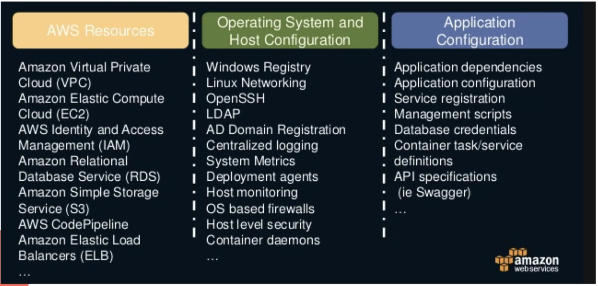
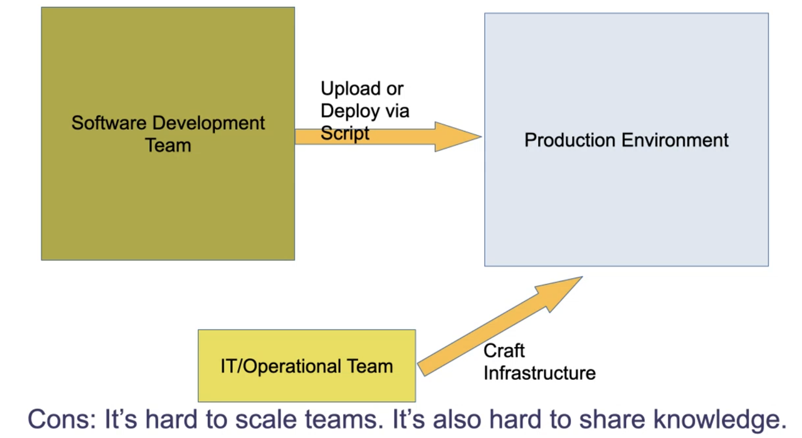
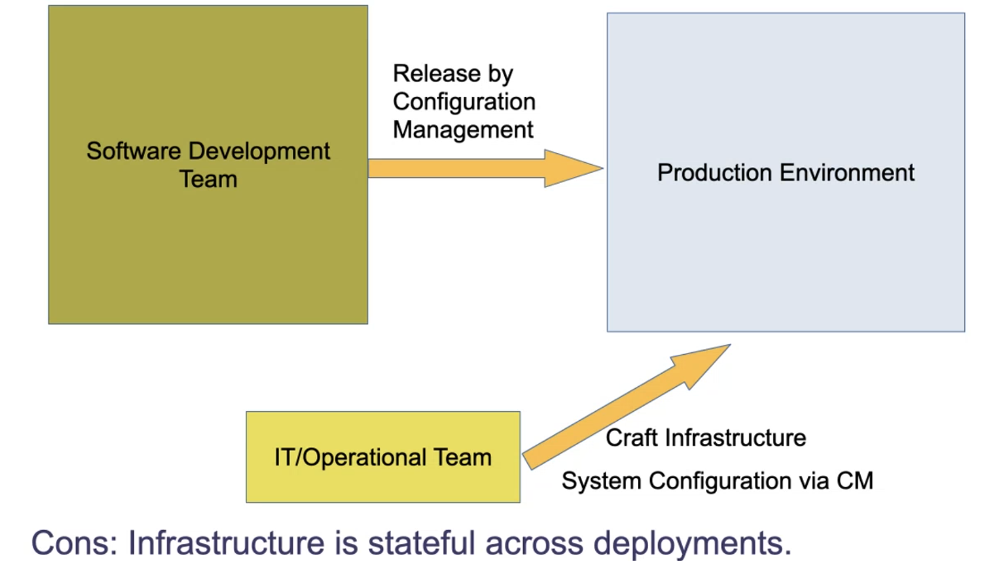
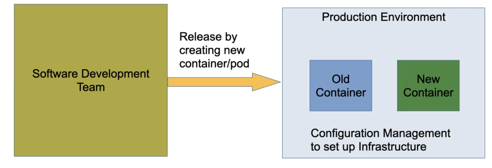
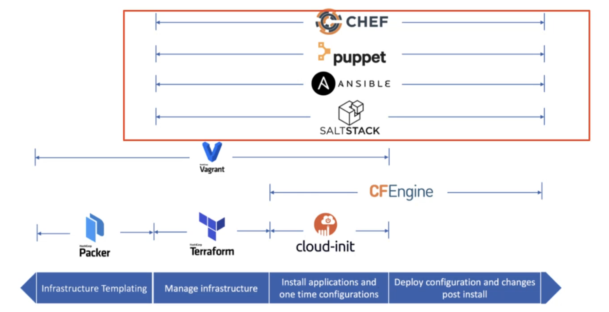
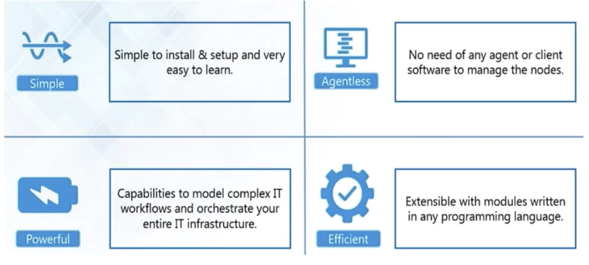
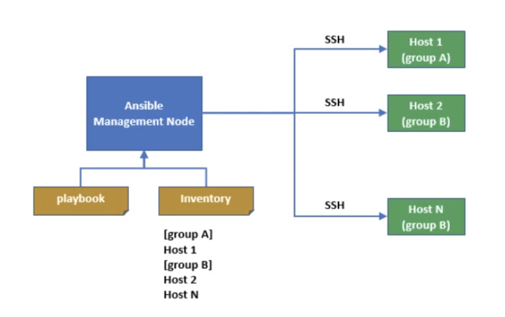
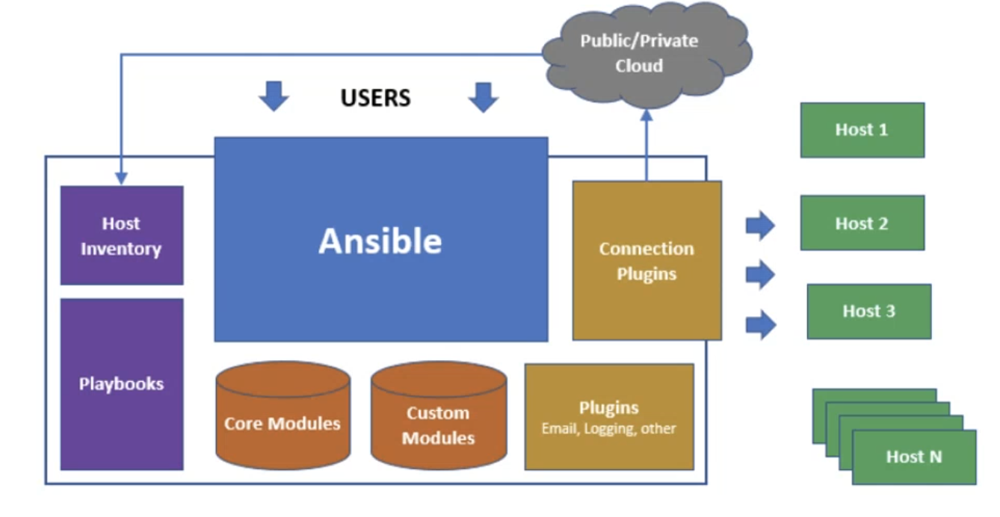

# Class-13-Configuration Management with Ansible&Packer
# Lecturer：Liji Yu
# 主要知识点
- [Agenda](#agenda)
- [Configuration Management Overview Ansible Overview & CM Big 4](#configuration-management-overview-ansible-overview---cm-big-4)
  * [Configuration Management](#configuration-management)
  * [Manual Config 手动配置](#manual-config-----)
  * [Complexity: Script](#complexity--script)
    + [Example](#example)
    + [Script Logic](#script-logic)
- [CM framework: ansible](#cm-framework--ansible)
  * [Big 4 of CM in short](#big-4-of-cm-in-short)
  * [Software Delivery Focus Evolution](#software-delivery-focus-evolution)
  * [Which tools for which](#which-tools-for-which)
- [Ansible Overview](#ansible-overview)
  * [What is Ansible?](#what-is-ansible-)
  * [How does Ansible works?](#how-does-ansible-works-)
  * [Ansible Galaxy](#ansible-galaxy)
  * [Ansible Roles](#ansible-roles)
- [Ansible Hands-on](#ansible-hands-on)

# Agenda
 - Configuration Management Overview Ansible Overview & CM Big 4
 - Packer overview
 - Ansible & Packer Hands-on

# Configuration Management Overview Ansible Overview & CM Big 4
## Configuration Management

In DevOps area, Configuration Management is the automated process to manage all the configurations of the environments that the software application hosted upon.

In simple words，

- Infrastructure Provisioning: Server  Provision a fresh Linux/Windows Server
- Configuration Management: Install application like docker/tomcat. 装软件 装application
- CI/CD: Build/Test application and use CM to deploy application All of them are coded and stored be in git repositories. 所有的配置都像代码一样，可以pr，可以merge，运行这些代码对服务器进行操作. 用管理产品的cicd的方法管理配置


一般来说，Infrastructure Provisioning是左边一列； configuration management包括右边两列。

## Manual Config 手动配置
- ssh and configure manually
    - Unreliable. 当配置变复杂，手动改很难
    - No records. 操作没有记录
- 不是主流的方法：缺乏复杂性和可拓展性
    - 人为错误不可靠
    - No review process. 没有好的方法去review
    - 效率不高，一次只能配一台机器或者配一台服务器
但是手动配置是基本功，特殊情况还是需要手动配置

## Complexity: Script
为了实现复杂性，使用脚本
- from document to code
    - bash
    - perl
    - ruby
    - python
    - Configuration management framework

### Example
Goal: To make sure "/etc/aconfig" has exact one line of "encryption:on"
The other content in that file remains unchanged
用命令或脚本的方式添加

```
 echo "encryption:on" > /etc/aconfig  # 将aconfig文件内容更改为只有 ”encryption: on“ 一句

 echo "encryption:on" >> /etc/aconfig  # 将”encryption: on“ 一句添加到文件的最后一行 
 # 两行命令结果一样，但上面是覆盖，下面是append到file.
 # What if we have "encryption:off"   # 如果源文件中有一句off，可能会产生错误
```
How to make sure “/etc/aconfig” has one line of

- “encryption: on”

```jsx
echo “encryption: on” > /etc/aconfig # overwrite other lines 
echo “encryption: on” >> /etc/aconfig # multiple lines
```

What if we have “encryption: off”

```jsx
If /etc/aconfig does not exist: 
	Create /etc/aconfig

If /etc/aconfig does not contain encryption config: 
	Add “encryption: on” 
Elif /etc/aconfig contains “encryption: on” 
	Do nothing 
Else:
	Change to “encryption: on”
```

如果每次都要写这么多，会变得越来越复杂，因此需要配置管理的架构。


### Script Logic
- What if file does not exist?
- What if user doesn't have the permision?
- How to sudo?
- Can I find the line with regular expression?


# CM framework: ansible
## Big 4 of CM in short


- Declarative声明what to do。保证idempotence幂等性，不管原来什么状态，配置文件不管跑几次都会一摸一样。但比较难实现。
- Imperative指定how to do。如果跑在不同机器，如果原来状态不一样，不一定会有一样的结果，配置文件也不一定能跑几次。如果有两个配置文件，顺序不一样也可能会导致状态不一样。

**Chef** and **Puppet** are pull based. They’re very stable and heavy. They suit to enterprise customers. AWS OpsWorks supports Chef only. Chef uses ruby language to define configuration.

Both **Ansible** and **Saltstack** are push based. They build upon Python and suit to Linux users more.

Ansible is very popular and lightweight. It’s agentless and we only need to configure IP address and SSH key.


Configuration Management Framework

- Config what to do instead of how to do
- DSL, YAML
- Configure large amount of servers
- Immutable servers & containers

## Software Delivery Focus Evolution


### No Configuration Management

最传统的方法，没有配置管理



### Mutable Infrastructure

可变的基础设施, 在一个服务器上不停的改动



配置漂移：某些文件在部署到服务器之后发生了一些变化，可能会导致应用程序不稳定，是系统的一大致命隐患。

### Immutable Infrastructure

服务器一旦部署不能更改，软件的环境需要新的环境时，部署一台新的服务器，通过流量迁移，慢慢替换，两台服务器相互切换
 - 蓝绿部署 - 控制流量访问不同版本的Env，支持A/B test


Switch from blue to green environment by switching DNS alias or via a mutable load balancer.

Cons: It’s relatively slow to release. Also infrastructure needs to be warmed up.

### Immutable Container/Pod



Use container orchestration tool to create new container/pod. Configuration Management is used to configure production environment.

**Do we still need Configuration Management?**

Yes，容器技术是很好用，但不是所有人都会用，有些公司可能不需要用到容器就已经够用了，这样还是需要ansible等配置管理工具。

## Which tools for which


# Ansible Overview
## What is Ansible?

Ansible is a Open Source Configuration Management, Deployment & Orchestration tools from RedHat.


## How does Ansible works?



Inventory lists managed nodes which will be configured. SSH has to be pre-configured so that Management Node or control node can control managed nodes.

playbook: 配置文件

inventory：所有ansible管的服务器的地址都在这里



**Plugin** runs on the control node to extend Ansible automation engine. 扩展一些功能

**Modules** runs on the managed node to configure managed node. 功能的分组

**Playbook** defines workflow of execution in YAML format.

## Ansible Galaxy

Ansible Galaxy is a shared repository of Ansible roles which usually install and configure a software.

Home of Ansible Galaxy: [https://galaxy.ansible.com/](https://galaxy.ansible.com/)

Example: [https://galaxy.ansible.com/geerlingguy/docker](https://galaxy.ansible.com/geerlingguy/docker) [https://galaxy.ansible.com/geerlingguy/java](https://galaxy.ansible.com/geerlingguy/java) [https://galaxy.ansible.com/geerlingguy/nginx](https://galaxy.ansible.com/geerlingguy/nginx)

Usage: [https://docs.ansible.com/ansible/latest/cli/ansible-galaxy.html](https://docs.ansible.com/ansible/latest/cli/ansible-galaxy.html)

## Ansible Roles


# Ansible Hands-on

https://github.com/australiaitgroup/DevOpsNotes/tree/main/WK7_CM_Ansible_Packer 

